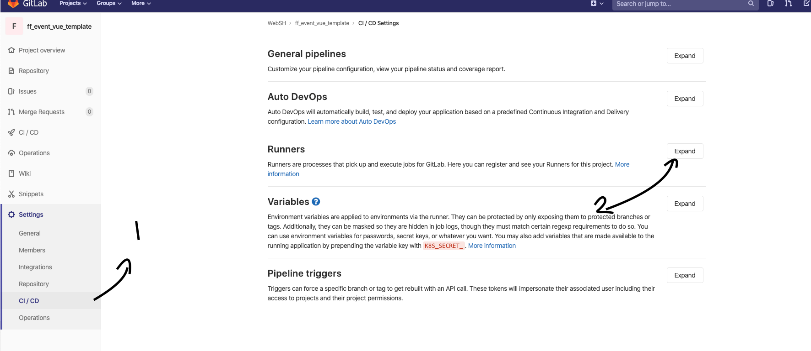
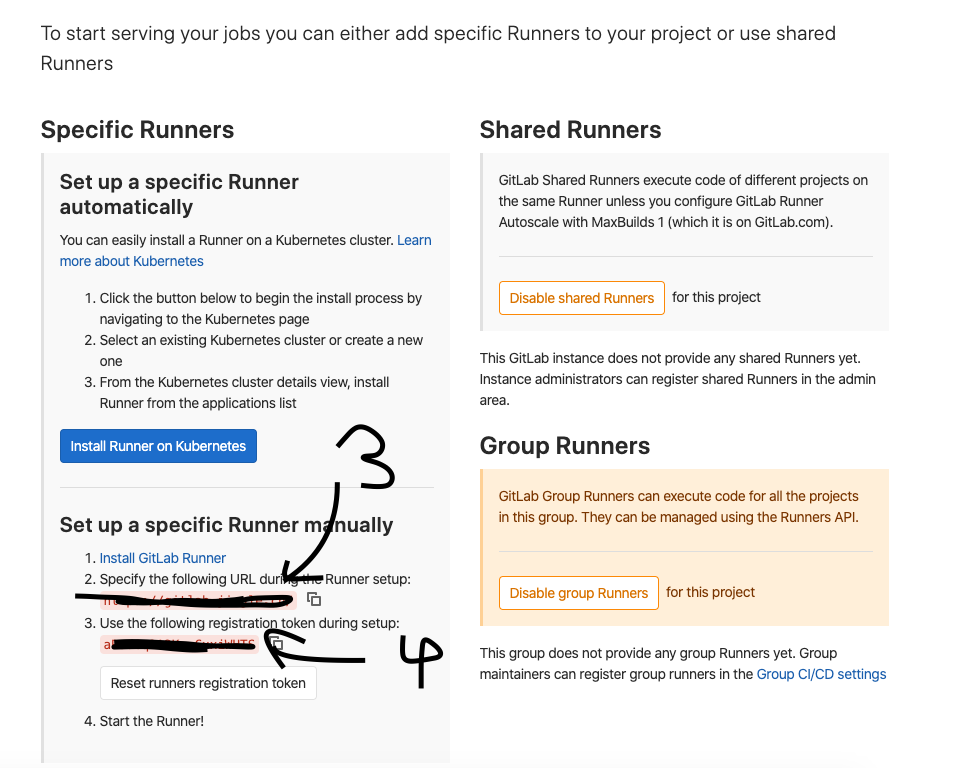
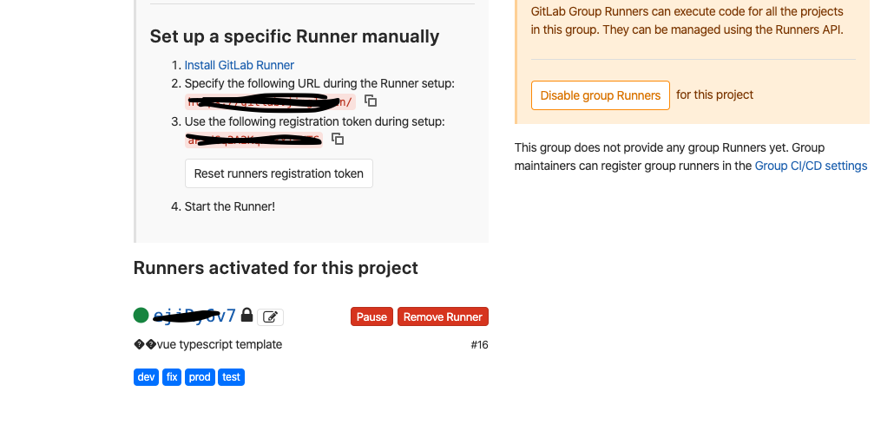
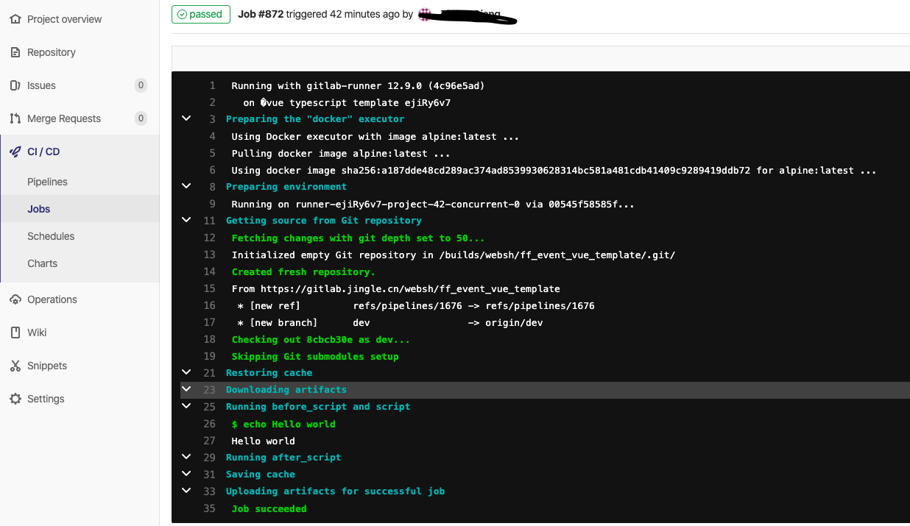

[TOC]

# 安装gitlab-runner

## 安装方式：docker compose

## 1.创建gitlab-ce目录
mkdir -p /home/rjzou/docker/gitlab-runner

## 2、在/home/rjzou/docker/gitlab-runner目录下创建docker-compose.yml

docker-compose.yml的内容如下：

```

version: "3.9"
services:
  gitlab-runner:
    image: "gitlab/gitlab-runner:latest"
    restart: always
    privileged: true
    volumes:
      - "/home/rjzou/docker/gitlab-runner/config:/etc/gitlab-runner"
      - "/var/run/docker.sock:/var/run/docker.sock"

```


## 3、使用docker compose up -d进行安装

```
docker-compose up -d

```

## 4、查看安装进度

```

docker-compose logs -f gitlab-runner

```

### 如果遇到如下错误：

```
ERROR: Failed to load config stat /etc/gitlab-runner/config.toml: no such file or directory  builds=0
#或者下面的
ERROR: Failed to load config stat /etc/gitlab-runner/config.toml: no such file or directory  builds=0
ERROR: Failed to load config stat /etc/gitlab-runner/config.toml: no such file or directory  builds=0
ERROR: Failed to load config stat /etc/gitlab-runner/config.toml: no such file or directory  builds=0
ERROR: Failed to load config stat /etc/gitlab-runner/config.toml: no such file or directory  builds=0
ERROR: Failed to load config stat /etc/gitlab-runner/config.toml: no such file or directory  builds=0

```


### 请执行如下命令：
```
docker run --rm -t -i -v /home/rjzou/docker/gitlab-runner/gitlab-runner/config:/etc/gitlab-runner gitlab/gitlab-runner register
```

## 这时候打开你的gitlab






### 上一步之后，会有一堆问题回答
```
Runtime platform                                    arch=amd64 os=linux pid=7 revision=4c96e5ad version=12.9.0
Running in system-mode.                            
                                                   
Please enter the gitlab-ci coordinator URL (e.g. https://gitlab.com/):
#上图3的网址
Please enter the gitlab-ci token for this runner:
#上图4的地址
Please enter the gitlab-ci description for this runner:
[3a594927a932]: vue typescript template
Please enter the gitlab-ci tags for this runner (comma separated):
#自己定义的标签，比如test,dev
Registering runner... succeeded                     runner=aPsdGq2A
Please enter the executor: docker-ssh, parallels, ssh, virtualbox, custom, docker, shell, docker+machine, docker-ssh+machine, kubernetes:
#写 docker
Please enter the default Docker image (e.g. ruby:2.6):
#写 alpine:latest
Runner registered successfully. Feel free to start it, but if it's running already the config should be automatically reloaded!
```

## 回到你的gitlab，你就能看到下面的东西





## 运行下面的命令查看是否有问题
```
docker logs gitlab-runner
```


## 然后我们在项目的根目录创建一个.gitlab-ci.yml
```
test_job_1:
    tags:
        - dev
    script:
        - echo Hello world
```

## 再push上去的时候就能看到成功了

