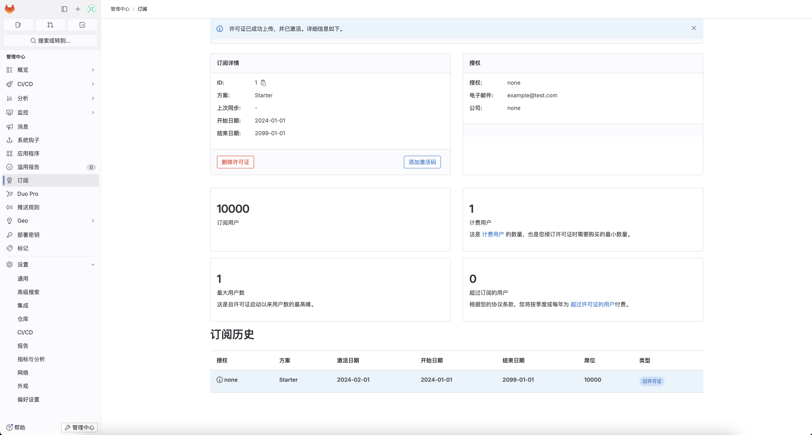

[TOC]

# 安装gitlab流程步骤

## 1.使用本文件夹 docker-compose.yaml
在宿主机上执行
```
sudo docker-compose up -d
```

## 2.生成破解密钥
在宿主机上执行
```
root@abcdocker:~# docker run -it --rm ruby /bin/bash
```
进入到ruby容器执行
```
root@d359bcd4ca50:/# gem install gitlab-license
```
## 3.创建license.rb文件

在ruby容器内执行
```
cat >license.rb<<'EOF'
    require "openssl"
    require "gitlab/license"
    key_pair = OpenSSL::PKey::RSA.generate(2048)
    File.open("license_key", "w") { |f| f.write(key_pair.to_pem) }
    public_key = key_pair.public_key
    File.open("license_key.pub", "w") { |f| f.write(public_key.to_pem) }
    private_key = OpenSSL::PKey::RSA.new File.read("license_key")
    Gitlab::License.encryption_key = private_key
    license = Gitlab::License.new
    license.licensee = {
    "Name" => "none",
    "Company" => "none",
    "Email" => "example@test.com",
    }
    license.starts_at = Date.new(2021, 1, 1) # 开始时间
    license.expires_at = Date.new(2050, 1, 1) # 结束时间
    license.notify_admins_at = Date.new(2049, 12, 1)
    license.notify_users_at = Date.new(2049, 12, 1)
    license.block_changes_at = Date.new(2050, 1, 1)
    license.restrictions = {
    active_user_count: 10000,
    }
    puts "License:"
    puts license
    data = license.export
    puts "Exported license:"
    puts data
    File.open("GitLabBV.gitlab-license", "w") { |f| f.write(data) }
    public_key = OpenSSL::PKey::RSA.new File.read("license_key.pub")
    Gitlab::License.encryption_key = public_key
    data = File.read("GitLabBV.gitlab-license")
    $license = Gitlab::License.import(data)
    puts "Imported license:"
    puts $license
    unless $license
    raise "The license is invalid."
    end
    if $license.restricted?(:active_user_count)
    active_user_count = 10000
    if active_user_count > $license.restrictions[:active_user_count]
        raise "The active user count exceeds the allowed amount!"
    end
    end
    if $license.notify_admins?
    puts "The license is due to expire on #{$license.expires_at}."
    end
    if $license.notify_users?
    puts "The license is due to expire on #{$license.expires_at}."
    end
    module Gitlab
    class GitAccess
        def check(cmd, changes = nil)
        if $license.block_changes?
            return build_status_object(false, "License expired")
        end
        end
    end
    end
    puts "This instance of GitLab Enterprise Edition is licensed to:"
    $license.licensee.each do |key, value|
    puts "#{key}: #{value}"
    end
    if $license.expired?
    puts "The license expired on #{$license.expires_at}"
    elsif $license.will_expire?
    puts "The license will expire on #{$license.expires_at}"
    else
    puts "The license will never expire."
    end
EOF

```

## 4.生成证书
在ruby容器内执行
```
root@d359bcd4ca50:/# ruby license.rb
```
生成 GitLabBV.gitlab-license license_key license_key.pub 这三个文件。

**(在gitlab容器内执行)**

将license_key.pub文件内容全部拷贝到Gitlab里`/opt/gitlab/embedded/service/gitlab-rails/.license_encryption_key.pub文件中 。

**重启gitlab容器**
**重启gitlab容器**
**重启gitlab容器**


再把GitLabBV.gitlab-license 内容前台输入到license注册码中

## 5.打开http://gitlab-IP:8929/admin/application_settings/general


上传GitLabBV.gitlab-license，勾选服务条款， 点 **添加许可证**




## 6 使用root登陆到后台 http://gitlab-IP:8929
## 7 查看root密码
 ```
 sudo docker exec -it gitlab grep 'Password:' /etc/gitlab/initial_root_password
 ```


 参考：https://i4t.com/21364.html